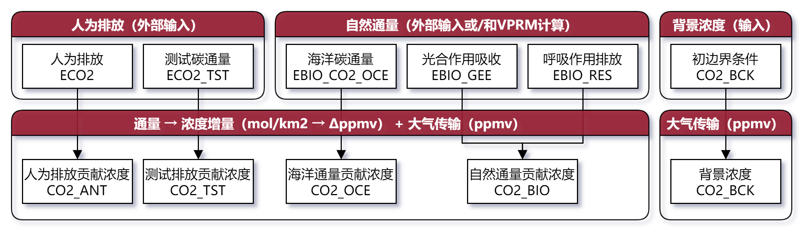
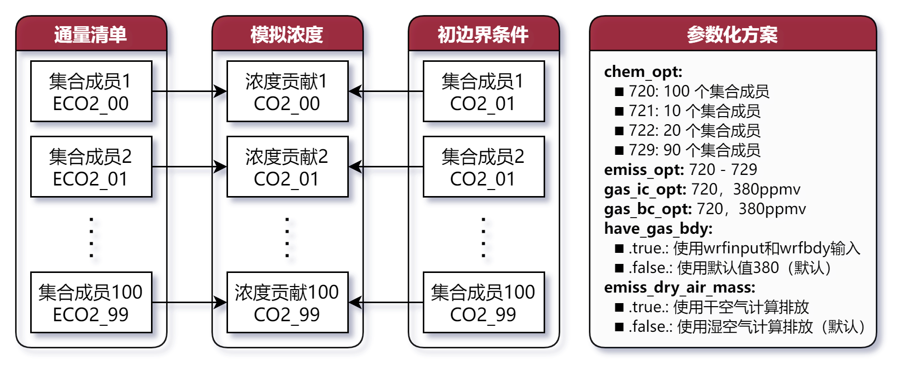
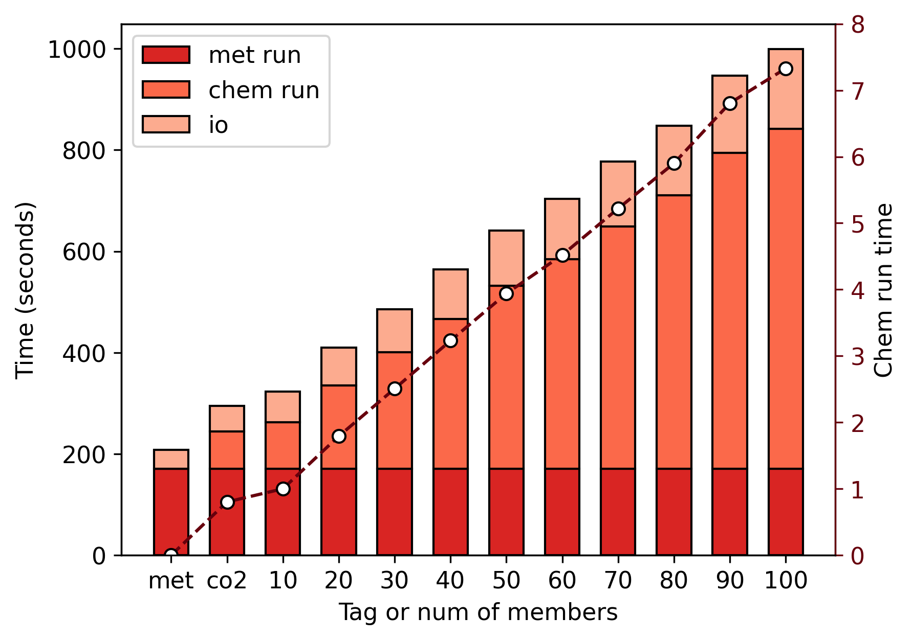

```
title: "WRFChem Ensemble CO<sub>2</sub>"
author: "周旭"
institude: "中国科学院大气物理研究所"
short_title: null
short_author: null
short_institude: null
other_char1: "1234567890"
other_char2: "abcdefghijklmnopqrstuvwxyzABCDEFGHIJKLMNOPQRSTUVWXYZ"
other_char3: "!@#$%^&*()_+~`-=[]{};':\",./<>?\\|"
```

# WRFChem Ensemble CO<sub>2</sub>

## 模式介绍

### 目前 WRFChem 模式$\mathrm{CO}_2$方案

* 主要模式过程分为排放处理和大气传输两部分，并未考虑$\mathrm{CO}_2$的化学反应
* 计算得到的$\mathrm{CO}_2$不会影响大气物理化学性质，也不会影响传输过程
* 对于不同的排放/通量的处理过程是一致的（区别仅在于变量名）



### 现有 WRFChem 模式的问题

1. **集合模拟需求：**
  * 运行多个集合，重复的气象过程计算导致了大量计算资源的浪费
  * 在集合计算中仅需要CO2_ANT一个变量，其他变量是不必要的
  * 对于多种不同情景，例如区分某个城市的增量，需要重复计算气象过程
2. **模式计算BUG：**
  * 在WRF-Chem开发者的认知中，目前模式中气体浓度为干空气摩尔分数
  * 模式传输计算中前后$\mathrm{CO}_2$基本守恒（也就是使用的干空气质量）
  * 模式通量计算中使用的空气质量为湿空气质量
  * 可能会导致通量计算的浓度增量存在约0.5%的误差（包括人为、自然）
  * 参考：[rho_phy and unit of tracers into WRF atmosphere]("https://forum.mmm.ucar.edu/threads/rho_phy-and-unit-of-tracers-into-wrf-atmosphere.9395/#:~:text=I'm%20using%20WRF%20to%20compute%20transport%20of%20passive%20greenhouse%20gas")

## 运行测试

### WRFChem 集合$\mathrm{CO}_2$模拟方案

* 增加了10个参数化方案，可分别模拟10-100个集合$\mathrm{CO}_2$
* 增加了控制排放计算使用干湿空气的选项
* 这些方案中不计算VPRM以及其他自然碳通量，全部依赖输入通量清单



### 测试方案设计

* **网格设定**
  * 网格大小：105×105×44
  * 网格距：9km
  * 模拟区域：中国东南福建省周边
* **运行设定**
  * 时间积分步长：36s
  * 运行时间：18h
  * 从重启文件开始运行
* **计算资源**
  * 大装置单节点64核心
* **对照 WRFChem $\mathrm{CO}_2$ 设置**：
  * 基本设置一致，关闭VPRM计算

### 运行效率评估

* 随着集合数目增加，运算耗时（包括IO和计算）线性增加
* 原始 WRFChem 的$\mathrm{CO}_2$耗时约为10集合成员时的0.8倍
* 化学时间积分步长选项（chemdt）不影响气象传输过程的积分步长

